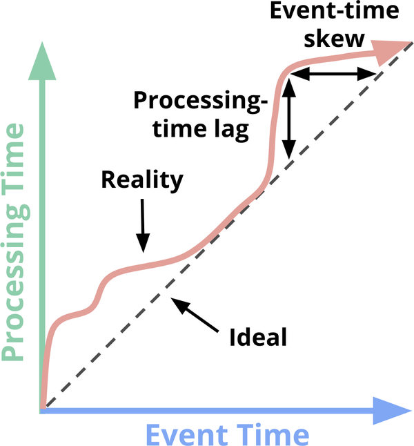

https://learning.oreilly.com/library/view/streaming-systems/9781491983867/ch01.html

Event Time Versus Processing Time

#### Event time
This is the time at which events actually occurred.

#### Processing time
This is the time at which events are observed in the system.

#### Processing time lag
The vertical distance between the ideal and the red line is the lag in the processing-time domain. That distance tells you how much delay is observed (in processing time) between when the events for a given time occurred and when they were processed. This is the perhaps the more natural and intuitive of the two skews.

#### Event time skew
The horizontal distance between the ideal and the red line is the amount of event-time skew in the pipeline at that moment. It tells you how far behind the ideal (in event time) the pipeline is currently.

